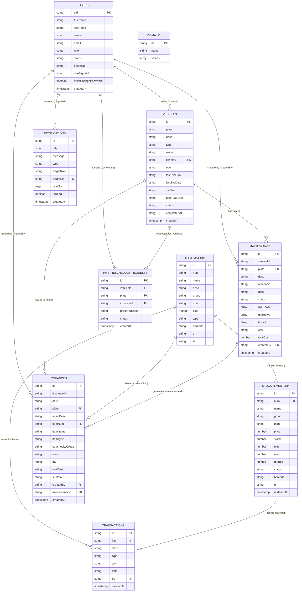

# ENTITY RELATIONSHIP DIAGRAM (ERD)

## Caltex AutoPro – Firebase Firestore Database Design

---

## 1. ERD Diagram (Mermaid)

---

## 2. Collection Details

### Table 1: `users`
Stores all system user accounts (Admin, Staff, Customer).

| Field | Type | Description |
|---|---|---|
| `uid` | String (PK) | Firebase Auth UID — used as document ID |
| `firstName` | String | User's first name |
| `lastName` | String | User's last name |
| `name` | String | Full name (`firstName + lastName`) |
| `email` | String | Email address (unique) |
| `role` | String | Role: `admin`, `staff`, or `customer` |
| `status` | String | Account status: `active`, `pending`, or `inactive` |
| `photoUrl` | String | Profile photo URL (optional) |
| `oneSignalId` | String | OneSignal push subscription ID for this device |
| `mustChangePassword` | Boolean | If `true`, user is forced to change password on first login |
| `createdAt` | Timestamp | Account creation date |

---

### Table 2: `vehicles`
Stores fleet vehicle records and PMS configuration.

| Field | Type | Description |
|---|---|---|
| `id` | String (PK) | Auto-generated Firestore document ID |
| `plate` | String | Vehicle plate number (unique, uppercase) |
| `desc` | String | Vehicle description (e.g., "Isuzu Truck NQR 2021") |
| `type` | String | Vehicle type (e.g., Truck, Car, Van, Motorcycle) |
| `owner` | String | Owner's full name (display string) |
| `ownerId` | String (FK → users.uid) | Firebase UID of the owner (customer) |
| `odo` | String | Current odometer reading (e.g., "45000 km") |
| `lastSvcOdo` | String | Odometer at last service |
| `lastSvcDate` | String | Date of last service (YYYY-MM-DD) |
| `svcFreq` | String | Service frequency in months (e.g., "3") |
| `nextPMSDue` | String | Computed next PMS due date (YYYY-MM-DD) |
| `status` | String | PMS status: `Active`, `PMS Due Soon`, `Overdue`, `Under Maintenance`, `Completed` |
| `completedAt` | Timestamp | Timestamp when status was set to Completed |
| `createdAt` | Timestamp | Record creation timestamp |

---

### Table 3: `maintenance`
Stores vehicle maintenance/service records with labor and parts rows.

| Field | Type | Description |
|---|---|---|
| `id` | String (PK) | Auto-generated Firestore document ID |
| `serviceId` | String | Human-readable service ID (e.g., "SVC-001") |
| `plate` | String (FK → vehicles.plate) | Vehicle plate number |
| `desc` | String | Vehicle description at time of service |
| `mechanic` | String | Name of the mechanic who performed the service |
| `date` | String | Date serviced (e.g., "Jan 5, 2026") |
| `status` | String | Service status: `Pending`, `Ongoing`, `Completed` |
| `svcRows` | Array | List of service/labor rows: `[{name, qty, uom, cost}]` |
| `matRows` | Array | List of material/parts rows: `[{name, qty, uom, cost}]` |
| `issues` | Array | List of reported vehicle issues (e.g., ["Engine Problem", "Brake Issue"]) |
| `cost` | String | Formatted total cost string (e.g., "₱1,500.00") |
| `totalCost` | Number | Numeric total cost (sum of svcRows + matRows) |
| `createdBy` | String (FK → users.name) | Name of the staff who created the record |
| `createdAt` | Timestamp | Record creation timestamp |

---

### Table 4: `item_master`
Master catalog of all inventory items and services.

| Field | Type | Description |
|---|---|---|
| `id` | String (PK) | Auto-generated Firestore document ID |
| `num` | String | Item number (unique identifier, e.g., "ITM-001") |
| `name` | String | Item name |
| `desc` | String | Item description |
| `group` | String | Commodity group (e.g., "Lubricants", "Filters") |
| `uom` | String | Unit of measure (e.g., "pcs", "liters", "set") |
| `cost` | Number | Unit cost in PHP |
| `type` | String | Item type: `Material` or `Service` |
| `barcode` | String | Barcode value for scanner lookup |
| `qr` | String | QR code value for scanner lookup |
| `sku` | String | Stock Keeping Unit code |

---

### Table 5: `stock_inventory`
Tracks current stock levels for each inventory item.

| Field | Type | Description |
|---|---|---|
| `id` | String (PK) | Auto-generated Firestore document ID |
| `num` | String (FK → item_master.num) | Item number (links to item_master) |
| `name` | String | Item name |
| `group` | String | Commodity group |
| `uom` | String | Unit of measure |
| `price` | Number | Unit price in PHP |
| `stock` | Number | Current stock quantity |
| `min` | Number | Minimum stock level (triggers Low alert) |
| `max` | Number | Maximum stock level |
| `reorder` | Number | Recommended reorder quantity |
| `status` | String | Stock status: `OK`, `Low`, or `Over` |
| `barcode` | String | Barcode value |
| `qr` | String | QR code value |
| `updatedAt` | Timestamp | Last stock update timestamp |

---

### Table 6: `issuances`
Records parts and services issued to a vehicle during maintenance.

| Field | Type | Description |
|---|---|---|
| `id` | String (PK) | Auto-generated Firestore document ID |
| `issuanceId` | String | Human-readable issuance ID (e.g., "ISS-AUTO-...") |
| `date` | String | Date of issuance (e.g., "Jan 5, 2026") |
| `plate` | String (FK → vehicles.plate) | Vehicle plate number |
| `assetDesc` | String | Vehicle description at time of issuance |
| `itemNum` | String (FK → item_master.num) | Item number from item master |
| `itemName` | String | Item name |
| `itemType` | String | Item type: `Material` or `Service` |
| `commodityGroup` | String | Commodity group of the item |
| `uom` | String | Unit of measure |
| `qty` | String | Quantity issued |
| `unitCost` | String | Unit cost at time of issuance |
| `subtotal` | String | Total cost (qty × unitCost) |
| `createdBy` | String (FK → users.name) | Name of the staff who recorded the issuance |
| `maintenanceId` | String (FK → maintenance.serviceId) | Linked maintenance service ID |
| `createdAt` | Timestamp | Record creation timestamp |

---

### Table 7: `transactions`
Logs all stock movement events (Stock IN and Stock OUT).

| Field | Type | Description |
|---|---|---|
| `id` | String (PK) | Auto-generated Firestore document ID |
| `item` | String (FK → item_master.name) | Item name |
| `desc` | String | Transaction description (e.g., "Issued for maintenance SVC-001 - ABC123") |
| `type` | String | Transaction type: `IN` (receive) or `OUT` (issuance) |
| `qty` | String | Quantity moved (negative for OUT, e.g., "-2") |
| `date` | String | Transaction date |
| `by` | String (FK → users.name) | Name of the staff who performed the transaction |
| `createdAt` | Timestamp | Record creation timestamp |

---

### Table 8: `notifications`
Stores system notifications for all roles.

| Field | Type | Description |
|---|---|---|
| `id` | String (PK) | Auto-generated Firestore document ID |
| `title` | String | Notification title (e.g., "🆕 New Account Registration") |
| `message` | String | Notification message body |
| `type` | String | Notification type: `info`, `warning`, `alert` |
| `targetRole` | String | Target role: `admin`, `staff`, or `customer` |
| `targetUid` | String (FK → users.uid) | Specific user UID (for personal notifications; empty for role-wide) |
| `readBy` | Map | Map of `{uid: true}` for users who have read the notification |
| `isRead` | Boolean | Global read flag |
| `createdAt` | Timestamp | Notification creation timestamp |

---

### Table 9: `domains`
Stores configurable dropdown/domain value lists used across the system.

| Field | Type | Description |
|---|---|---|
| `id` | String (PK) | Auto-generated Firestore document ID |
| `name` | String | Domain name (e.g., "vehicle_types", "commodity_groups") |
| `values` | Array | List of string values for the dropdown (e.g., ["Truck", "Car", "Van"]) |

---

## 3. Relationships Summary

| Relationship | Type | Description |
|---|---|---|
| `users` → `vehicles` | One-to-Many | One customer can own many vehicles (`ownerId`) |
| `users` → `maintenance` | One-to-Many | One staff/admin can create many maintenance records (`createdBy`) |
| `users` → `issuances` | One-to-Many | One staff can record many issuances (`createdBy`) |
| `users` → `notifications` | One-to-Many | Notifications can target a specific user (`targetUid`) |
| `vehicles` → `maintenance` | One-to-Many | One vehicle can have many maintenance records (`plate`) |
| `vehicles` → `issuances` | One-to-Many | One vehicle can have many parts/services issued (`plate`) |
| `item_master` → `stock_inventory` | One-to-One | Each item in the master catalog has one stock record (`num`) |
| `item_master` → `issuances` | One-to-Many | One item can be issued many times (`itemNum`) |
| `item_master` → `transactions` | One-to-Many | One item can have many stock movement transactions (`item`) |
| `maintenance` → `issuances` | One-to-Many | One maintenance record auto-generates issuances on completion (`maintenanceId`) |
| `stock_inventory` → `transactions` | One-to-Many | Each stock change is logged as a transaction |

---

## 4. Notes on Firestore NoSQL Design

Since Firebase Firestore is a **NoSQL document database**, there are no enforced foreign keys or JOIN operations. Relationships are maintained through:

- **Reference fields** — storing the related document's ID or a unique key (e.g., `plate`, `num`, `uid`) in the child document.
- **Denormalization** — some fields like `itemName`, `assetDesc`, and `createdBy` are stored as strings (not just IDs) to avoid extra reads at display time.
- **Real-time listeners** — `onSnapshot()` is used across all collections so the UI updates automatically when any document changes.
- **Sub-arrays** — `svcRows[]` and `matRows[]` inside `maintenance` documents store embedded line items instead of a separate sub-collection, keeping reads efficient.

---

### Table 10: `pms_reschedule_requests`
Stores customer-submitted PMS reschedule requests for overdue vehicles.

| Field | Type | Description |
|---|---|---|
| `id` | String (PK) | Auto-generated Firestore document ID |
| `vehicleId` | String (FK → vehicles.id) | Firestore document ID of the vehicle |
| `plate` | String (FK → vehicles.plate) | Vehicle plate number (for display) |
| `customerId` | String (FK → users.uid) | Firebase UID of the customer who submitted the request |
| `preferredDate` | String | Customer's preferred reschedule date (YYYY-MM-DD) |
| `status` | String | Request status: `Pending`, `Approved`, or `Dismissed` |
| `createdAt` | Timestamp | Timestamp when the request was submitted |

**Status flow:**
- `Pending` — submitted by customer, awaiting admin review
- `Approved` — admin approved the preferred date
- `Dismissed` — admin dismissed the request
