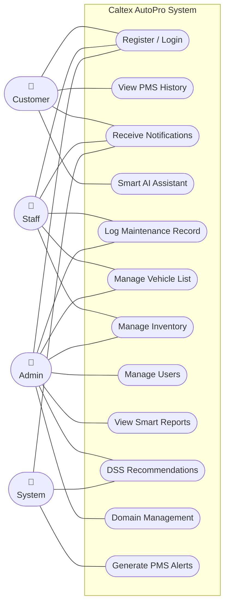
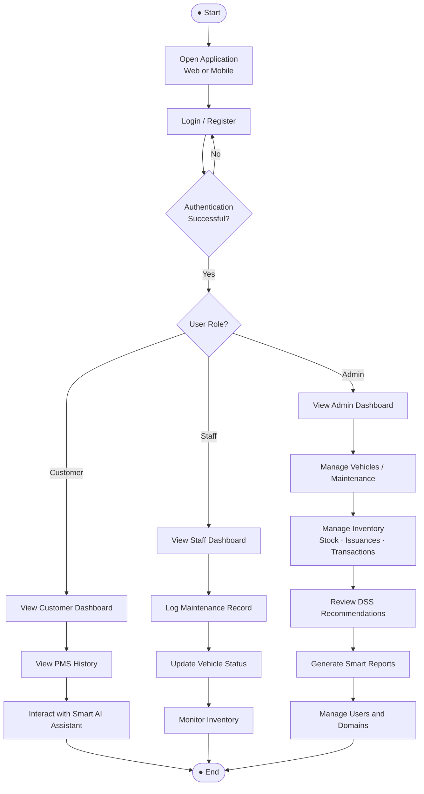
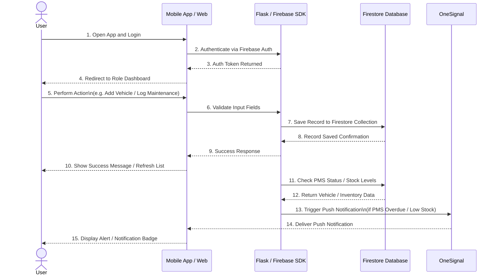

# UML DIAGRAMS: USE CASE, ACTIVITY, SEQUENCE

---

## 1. USE CASE DIAGRAM
*(Actors and Interactions)*

**Legend:**
- 👤 Actor
- `([ ])` Use Case
- `---` Association

---

## 2. ACTIVITY DIAGRAM
*(Process Flow)*

---

## 3. SEQUENCE DIAGRAM
*(Interaction Over Time)*

**Legend:**
- `—→` Request / Message
- `- - →` Response

---

## Diagram Summary

| Diagram | Purpose | Key Elements |
|---|---|---|
| **Use Case** | Shows what each actor can do in the system | Actors: Customer, Staff, Admin, System. Use Cases: Login, PMS History, Maintenance Logging, Inventory, Reports, DSS, Notifications |
| **Activity** | Shows the step-by-step process flow from login to role-based actions | Start → Login → Role Check → Role-specific workflow → End |
| **Sequence** | Shows how components interact over time for a typical user action | User ↔ App ↔ Firebase Auth ↔ Firestore ↔ OneSignal |
